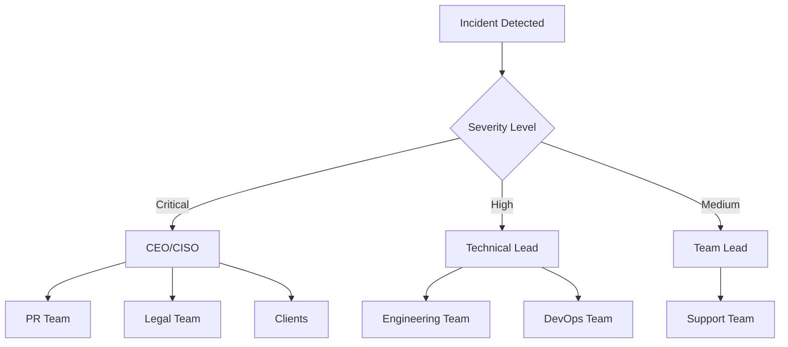

# Business Continuity Plan - Social Media App

## RTO (Recovery Time Objective)
- Critical Systems: 15 minutes
- Core Features: 1 hour
- Non-critical Features: 4 hours

## RPO (Recovery Point Objective)
- User Data: 5 minutes
- Post Content: 15 minutes
- Analytics: 1 hour

## Disaster Scenarios & Responses

### Scenario 1: Database Failure
**Impact**: Application unavailable
**Response**:
1. Auto-failover to read replica (30 seconds)
2. Restore from latest backup if replica unavailable
3. Point-in-time recovery if needed
**RTO**: 5 minutes

### Scenario 2: Region Outage
**Impact**: Complete service unavailable
**Response**:
1. Activate backup region
2. Update DNS (Cloudflare failover)
3. Restore from cross-region backup
**RTO**: 30 minutes

### Scenario 3: Data Corruption
**Impact**: Data integrity issues
**Response**:
1. Identify corruption scope
2. Point-in-time recovery
3. Replay WAL logs
4. Data validation
**RTO**: 2 hours

### Scenario 4: Security Breach
**Impact**: Compromised data/system
**Response**:
1. Isolate affected systems
2. Forensic analysis
3. Restore clean backups
4. Security patches
**RTO**: 4 hours

## Communication Tree

## Recovery Procedures

### Automated Recovery (Priority 1)
- Database failover
- Load balancer failover
- CDN failover

### Semi-Automated (Priority 2)
- Backup restoration
- Configuration rollback
- Cache warming

### Manual Procedures (Priority 3)
- DNS changes
- Security verification
- Client notifications

## Testing Schedule
- Weekly: Backup verification
- Monthly: DR failover test
- Quarterly: Full BCP simulation
- Annually: Third-party audit

## Contact Information
- Emergency Hotline: +1-XXX-XXX-XXXX
- Security Team: security@socialmediaapp.com
- DevOps Team: devops@socialmediaapp.com
- Client Support: support@socialmediaapp.com